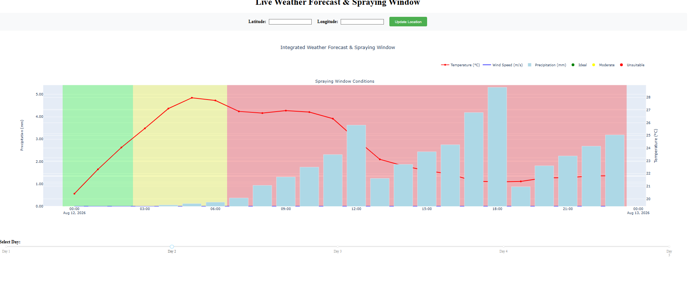

# Live Weather Forecast & Spraying Window

A Dash-based weather forecast dashboard that shows hourly temperature, wind speed, and precipitation alongside a spraying-condition heatmap for a selected location.



> Save the screenshot image as `screenshot.png` in the repository root. GitHub will render it directly in the README.

## What this project does

- Accepts latitude and longitude input from the user
- Fetches hourly weather forecast data from a private API
- Displays:
  - Temperature line
  - Wind speed line
  - Precipitation bars
  - Spraying-window condition overlay (Ideal / Moderate / Unsuitable)
- Supports a 5-day selector slider
- Automatically updates the selected day using a timer

## Repository structure

- `main.py` - Dash application layout and callbacks
- `fetch.py` - Loads `API_URL` from `.env` or environment variables and fetches forecast data
- `visualization.py` - Builds the Plotly visualization for spraying conditions
- `.env.example` - Safe placeholder template for private environment values
- `.env` - Local-only private configuration (ignored by Git)
- `.gitignore` - Excludes `.env`, `myvenv/`, and Python cache files
- `myvenv/` - Local Python virtual environment
- `static/`, `templates/` - currently empty folders for future static assets or templates

## Requirements

- Python 3.13
- `dash`
- `plotly`
- `requests`
- `numpy`

These packages are available in the local `myvenv` environment.

## Setup

1. Create and activate a virtual environment:

```powershell
python -m venv myvenv
.\myvenv\Scripts\Activate.ps1
```

2. Install the required packages:

```powershell
pip install dash plotly requests numpy
```

3. Copy `.env.example` to `.env`:

```powershell
copy .env.example .env
```

4. Open `.env` and update `API_URL` with your private API endpoint.

> Do not commit `.env` to GitHub.

## Running the app

```powershell
python main.py
```

Then open the browser at:

```
http://127.0.0.1:8050
```

## How to use

1. Enter latitude and longitude values
2. Click `Update Location`
3. Use the day slider at the bottom to switch between forecast days
4. Review the graph and spraying-condition overlay

## Important notes

- `.env` is ignored by Git via `.gitignore`
- `.env.example` is safe to commit and should remain as a template
- `myvenv/` is also ignored and should not be committed
- If you want to share this repo publicly, never put private API endpoints or credentials into source files

## Optional GitHub README sections to add

- `Features`
- `Demo`
- `Installation`
- `Configuration`
- `Usage`
- `Project structure`
- `Security and secrets`

## Suggested GitHub push checklist

- Commit:
  - `main.py`
  - `fetch.py`
  - `visualization.py`
  - `.gitignore`
  - `.env.example`
  - `README.md`
- Do not commit:
  - `.env`
  - `myvenv/`
  - `__pycache__/`

## Notes from the screenshot

- The UI includes the `Latitude` and `Longitude` input fields and `Update Location` button.
- The graph shows a multi-series forecast with a colored background for spraying conditions.
- The slider at the bottom is labeled `Select Day:` and can choose days 1 through 5.
